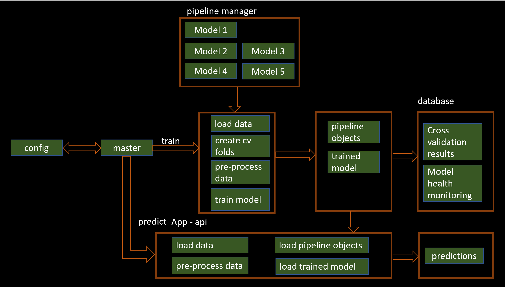

# Customer Loyalty Solution

```
Purpose 	: Building generic Customer Loyalty RFM Solution pipelines
Author   	: Prav
Constraints : Many ways to build solution design
			  Try to simplify as much as possible in iteration 01
```

##Contribution list
```
Open to accept any contributions

log information
date          version    author   comments
01-03-2020    0.1        Prav     initial iteration
```
## Execution Structure
	-->master.py
	 |-->config.yaml
	 |-->src.customer_rfm.py
    -->app.py
## Source files	
```
Please download source files from kaggle : https://www.kaggle.com/regivm/retailtransactiondata
```

## Solution Files 

```	 
config.config.yaml
	configuration file to provide all required parameters to solution
	
master.py
    master file for instantiation and running the entire solution
    reading configuration file settings

src.customer_rfm.py
	file for reading source data
    source data can be either from raw data or feature store 
    source data - csv file, database, big data or any source connection
    requires updates as source data changes
	
	source data - trainingSet, validationSet and testingSet
    cv split method - defined from config file
    requires updates as cv method changes
	
	generic functions to call models functions
    specific train, validate, cv, predict functions

app.py
	Flask api app to run the models at real time predictions using trained model objects
```	
## Installation
```
No installation required, please download solution files
```
## Execution
```
Update solution folder path in solution files for reading source files and config file at

config.yaml
source_file_path: C:\Users\adepup\Documents\Prav-Development\Research\github\customer_loyalty\data\Retail_Data_Transactions.csv

master.py 
config = yaml.safe_load(open(r"C:\Users\adepup\Documents\Prav-Development\Research\github\customer_loyalty\config\config.yaml"))

Run master.py file
../python master.py
```
## Solution Architecture


## Acknowledgments

* Inspiration from open source projects
* etc

### Todos

 - Add MORE algorithms
 - Write more test cases
 - Write more comments and PEP8 standard checks

